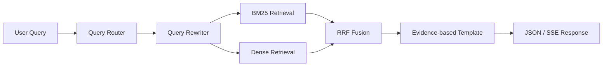

# Chinese Recipe RAG System

> 基于混合检索与 RRF 融合重排的中式食谱智能问答系统

项目面向菜品推荐、食材查询和分步做法问答，将离线语义检索、BM25 关键词检索和 RRF 融合重排组合为可评测的 RAG 链路，并通过 FastAPI + SSE 输出可追溯的流式结果。

> 本仓库使用本地模拟食谱和自建查询集进行工程验证，不代表真实线上用户效果。默认流程不调用外部大模型，也不需要 API Key。

## 项目解决什么问题

食谱问答同时包含菜名、食材、口味和做法等不同信号。只做向量检索容易忽略精确食材，只做关键词检索又难以处理口语表达。本项目通过查询路由和改写统一输入，再将双路召回结果用 RRF 融合，最后基于召回证据生成带来源的离线回答。

## 架构



## 关键设计

### 1. 混合检索与 RRF

- BM25 使用中文字级 unigram/bigram，保留菜名和食材的精确命中能力。
- 默认语义后端使用稳定哈希向量和余弦相似度，无模型下载也能离线复现排序。
- RRF 只使用排名信息融合两路结果，避免直接比较不同量纲的相似度分数。
- `BGEFaissRetriever` 保留 BGE Embedding + FAISS 的可选实现，与默认后端使用相同的 `search` 边界。

### 2. 查询路由与口语改写

`pipeline.py` 将查询分为三类：

| 类型 | 示例 | 输出重点 |
|---|---|---|
| 菜品推荐 | `我想吃排骨，推荐一道菜` | 返回 Top-3 候选菜品 |
| 食材查询 | `红烧牛腩需要什么食材` | 展开最相关食谱的原料 |
| 步骤问答 | `糖醋排骨怎么做` | 输出编号步骤和来源 ID |

改写模块会清理“请问”、“麻烦”、“一下”等口语填充词，保留菜名、食材和做法意图。

### 3. FastAPI + SSE

- `GET /health`：返回服务状态和已加载食谱数。
- `POST /search`：返回查询类型、改写结果、检索分数和模板回答。
- `POST /chat/stream`：按 `route -> retrieval -> answer` 输出 SSE 事件；执行失败时用 `error` 事件正常结束流。

## 离线评测

本地模拟语料包含 323 条食谱和 120 条多类型查询。评测模块根据每条查询的期望食谱 ID 计算 Hit@5。

| 链路 | 命中数 | Hit@5 |
|---|---:|---:|
| 单路基线 | 82 / 120 | 68.3% |
| 查询优化 + 混合检索 + RRF | 106 / 120 | 88.3% |

相对提升为 `(88.3% - 68.3%) / 68.3% ≈ 29.3%`，因此简历中表述为 Hit@5 由约 68% 提升至 88%，相对提升约 29%。仓库中的排名快照用于复现指标计算口径，这些数字不应解释为线上服务指标。

运行评测：

```bash
recipe-rag-eval
```

## 目录结构

```text
chinese-recipe-rag/
├── README.md
├── pyproject.toml
├── scripts/build_demo_data.py
├── src/recipe_rag/
│   ├── retriever.py       # BM25、离线向量、RRF 与可选 BGE/FAISS
│   ├── pipeline.py        # 路由、改写与模板回答
│   ├── evaluation.py      # Hit@5 评测
│   ├── api.py             # FastAPI 与 SSE
│   └── data/              # 323 条食谱、120 条查询与排名快照
└── tests/
```

## 本地运行

```bash
python -m venv .venv

# Windows PowerShell
.venv\Scripts\Activate.ps1

python -m pip install -e ".[dev]"
pytest -q
uvicorn recipe_rag.api:app --reload
```

服务启动后可访问 `http://127.0.0.1:8000/docs` 查看接口。

重新生成模拟数据：

```bash
python scripts/build_demo_data.py
```

如需尝试 BGE + FAISS 后端：

```bash
python -m pip install -e ".[full]"
```

`BAAI/bge-small-zh-v1.5` 需在首次使用时准备好本地模型文件；默认离线链路不依赖该模型。

## 已知限制

- 食谱文本由固定模板生成，只用于演示数据处理、检索和评测链路。
- 默认哈希向量不具备真实 BGE 模型的语义泛化能力。
- 离线模板回答不进行开放式生成，但能确保内容来自召回证据。

## License

[MIT](LICENSE)
